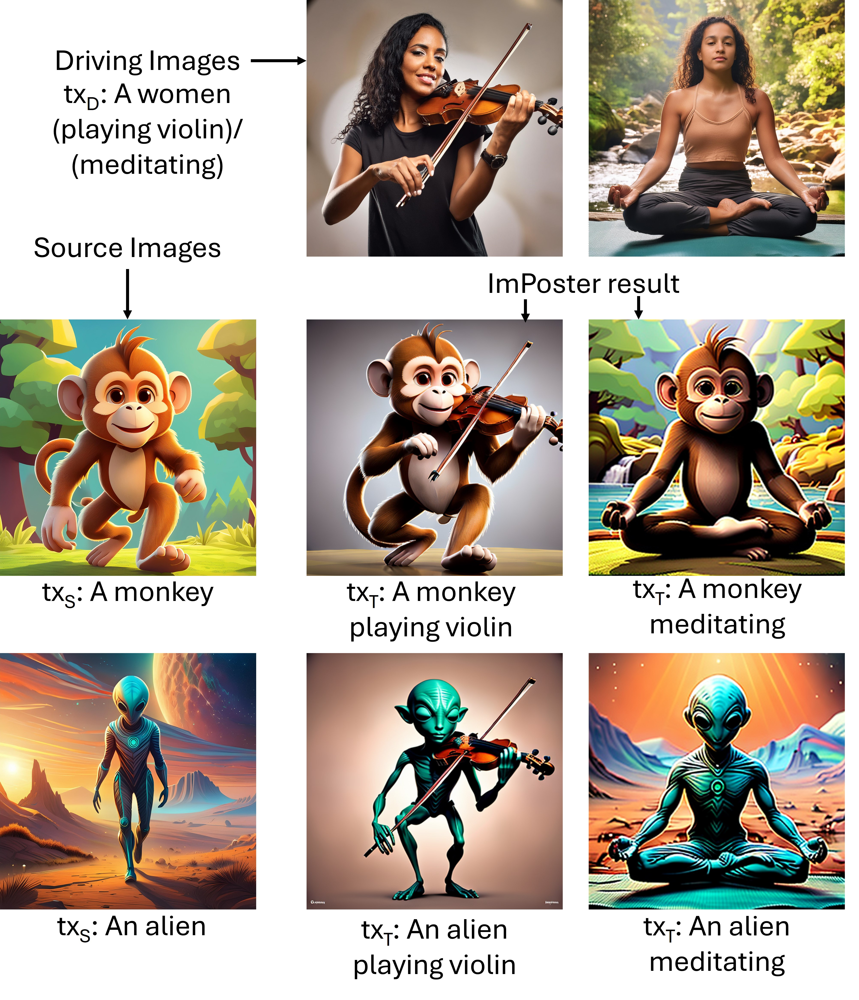

Paper: [**ImPoster: Text and Frequency Guidance for Subject Driven Action Personalization using Diffusion Models**]([[https://arxiv.org/abs/2311.15478](https://arxiv.org/abs/2409.15650)](https://arxiv.org/abs/2409.15650)) (COLING 2025)

Please cite our paper if you find it useful. <br>

```
@article{kothandaraman2024imposter,
  title={ImPoster: Text and Frequency Guidance for Subject Driven Action Personalization using Diffusion Models},
  author={Kothandaraman, Divya and Kulkarni, Kuldeep and Shekhar, Sumit and Srinivasan, Balaji Vasan and Manocha, Dinesh},
  journal={arXiv preprint arXiv:2409.15650},
  year={2024}
}
```

<p align="center">

</p>

### Method

<p align="center">

</p>

### Acknowledgements

This codebase is heavily borrowed from (https://github.com/divyakraman/HawkI2024).
